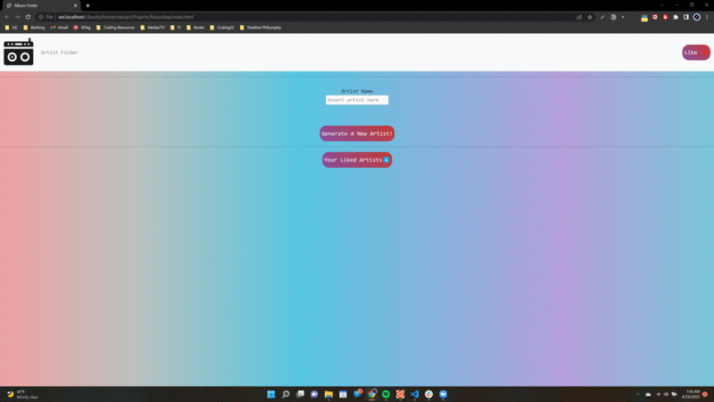
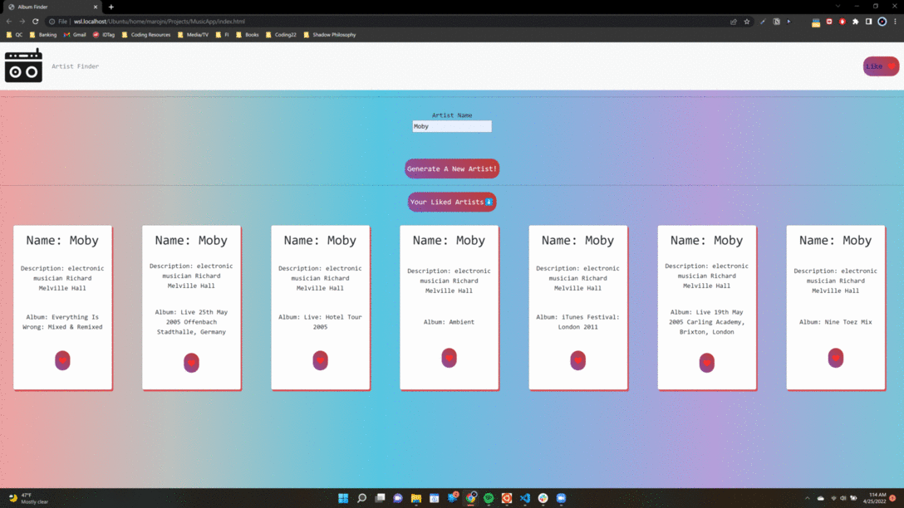
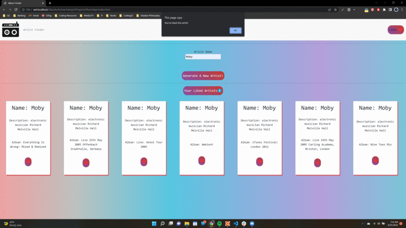

The Album Finder App
(Find your favorite artists albums!)

https://github.com/mariamnersisyan97/MusicFinderApp

This app was made with music lovers in mind! A quick search for your favorite artist will render some information about them as well as a detailed search of their discography!.

Features:

- Search through libraries of artists and find your favorite albums
- Can locate artists with a simple search
- View top 20 albums of the artist you've searched
- Can like any artist of your choosing
- View a list of your liked artists

How To Navigate:

Find the input form and enter an artist of your choice as such:

Be sure to give the button a click to generate your artists discography!

Give the artist a like by clicking the Like! button on the right hand side.

You will get an alert that you have successfully liked the artist.

Watch as the artist you like appears on your artist playlist!

Technologies Used:
API: https://musicbrainz.org/
Bootstrap
HTML/CSS/Vanilla JS
